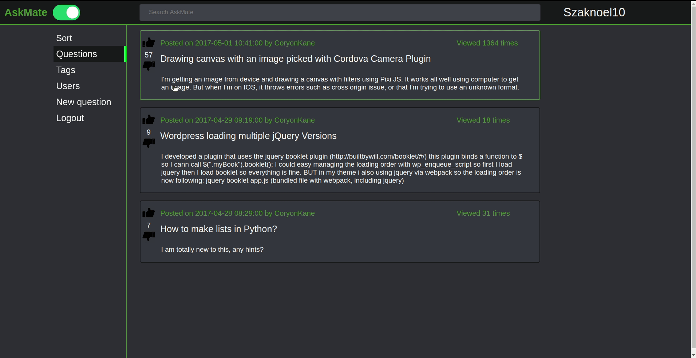

# AskMate

## Description

This is a Q&A page, where you can ask questions and answers them. Like Reddit. It's our first web project.

## Implemented

- Ask question
- Answer
- Comment
- Like system
- User system
- Registration/Login
- Tags
- Edit/delete

### Missing

- More responsive side
- Security

## Technologies

- Python
- Flask
- JavaScript
- PostgreSql
- CSS
- HTML

## Install and run

- Install python, pip3, and PostgreSql
- Create a database with PostgreSql
- virtualenv venv
- source venv/bin/activate
- venv/bin/pip install -r requirements.txt
- Create a postgreSql database
- Setup the environment variables
  - PSQL_USER_NAME="username"
  - PSQL_PASSWORD="password"
  - PSQL_HOST="localhost"
  - PSQL_DB_NAME="database name"
- Run the sql (askmatepart2-sample-data.sql) file
- Run server.py and open the page in a browser
